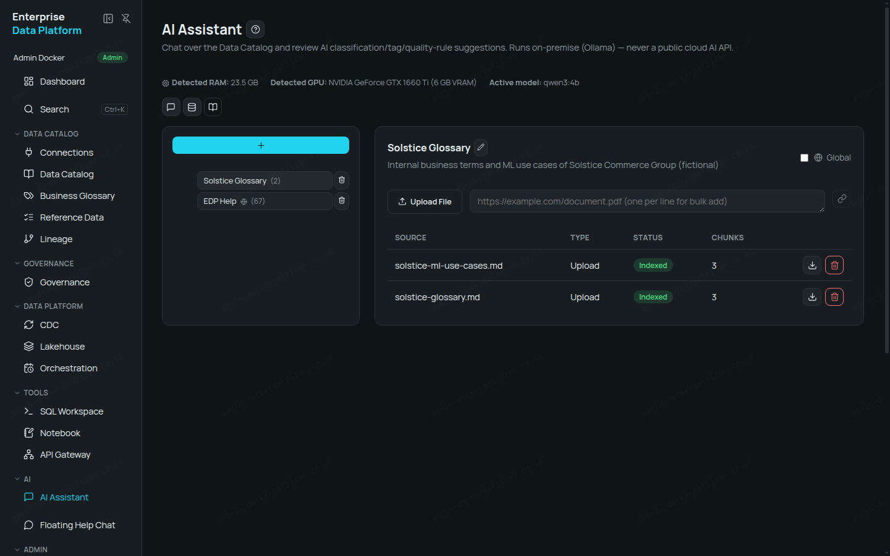
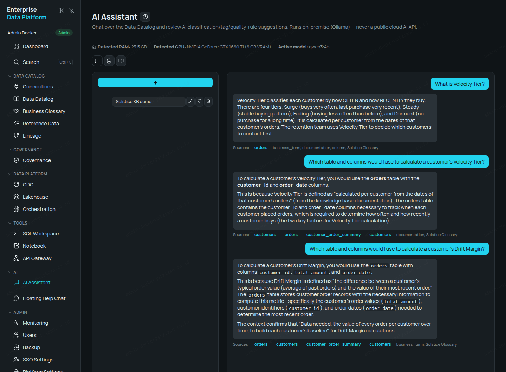
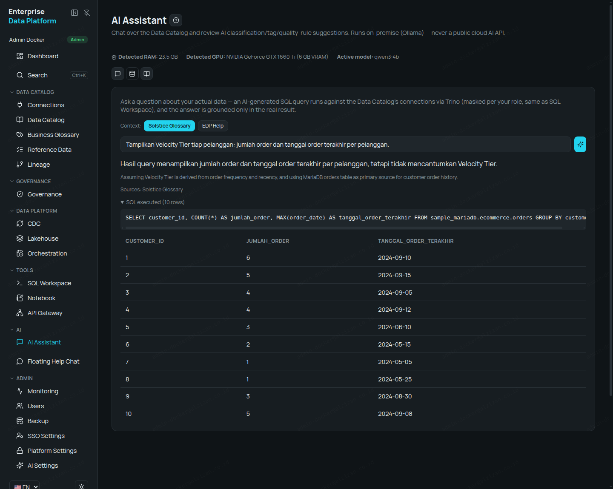

# Walkthrough — AI yang Memahami Istilah Bisnis Karangan (Knowledge Base + Data Catalog + NL2SQL)

Enterprise Data Platform menjawab pertanyaan tentang istilah bisnis yang **100% fiktif** — istilah
yang tidak ada di internet — dengan menyebut tabel dan kolom yang benar di database Anda, lalu
membuat SQL-nya dalam bahasa Indonesia. Semua jawaban dan screenshot di bawah nyata, dijalankan
**on-premise** (Ollama `qwen3:4b`, GPU konsumen 6 GB) — tidak ada data yang dikirim ke layanan AI
publik.

## Kenapa Test Ini Meyakinkan

- Dua dokumen KB berisi istilah bisnis **100% karangan** ("Velocity Tier", "Glimmer Score",
  "Drift Margin", dst.) milik perusahaan fiktif "Solstice Commerce Group" — model AI tidak mungkin
  tahu istilah ini dari pengetahuan umum.
- Dokumen **tidak pernah menyebut nama tabel/kolom**. Kalau AI menyebut tabel & kolom yang benar,
  berarti ia menghubungkan definisi di Knowledge Base dengan skema nyata di Data Catalog.

## Persiapan (sekali, ±10 menit)

1. **Sample data**: pasang sample PostgreSQL (`ecommerce`) —
   `curl -fsSL https://get.alzizan.co.id/sample-data | bash -s -- --services postgres` —
   daftarkan di **Connections**, lalu **Scan** (11 tabel, termasuk `customers`, `orders`, `products`).
2. **AI-Drafted Documentation** untuk `customers`, `orders`, `products` (Data Catalog → detail
   tabel → generate). Hasil nyata: 20 draft, 46–145 detik per tabel, semuanya akurat — mis.
   `orders.order_date` → "Date when the order was placed", `orders.total_amount` → "Total monetary
   value of the order". Review lalu **Approve**.
3. **Knowledge Base**: buat KB "Solstice Glossary" (AI Assistant → Knowledge Base), upload
   `kb/solstice-glossary.md` dan `kb/solstice-ml-use-cases.md` → masing-masing ter-index 3 chunk.

   

4. (Disarankan) **Admin → AI Settings** → baris *AI Assistant chat* → Thinking **Off** (jawaban
   lebih cepat, kualitas tetap baik untuk kasus ini).

## Langkah — Tanya AI Assistant (konteks: Data Catalog + Solstice Glossary)



**Q1 — "What is Velocity Tier?"** (19 detik)
> Velocity Tier classifies each customer by how OFTEN and how RECENTLY they buy. There are four
> tiers: Surge, Steady, Fading, and Dormant. It is calculated per customer from the dates of that
> customer's orders. The retention team uses Velocity Tier to decide which customers to contact
> first.

**Q2 — "Which table and columns would I use to calculate a customer's Velocity Tier?"** (38 detik)
> To calculate a customer's Velocity Tier, you would use the **orders** table with the
> **customer_id** and **order_date** columns. […] The orders table contains the customer_id and
> order_date columns necessary to track when each customer placed orders.

Pada run lain AI juga menjelaskan kenapa `customer_order_summary` tidak cukup (tidak menyimpan
tanggal tiap order) — ia menolak tabel ringkasan dengan alasan, bukan sekadar menebak.

**Q3 — "Which table and columns would I use to calculate a product's Glimmer Score?"** (51 detik)
> - **products table** (columns: `category`, `price`)
> - **orders table** (columns: `product_id`, `order_date`)

Sesuai definisi: posisi harga dalam kategori + seberapa sering produk sekategori dipesan.

## Langkah Tambahan — Steward Menautkan Istilah di Business Glossary

Untuk **Drift Margin**, pencarian awalnya condong ke tabel `customers`, dan AI menjawab jujur bahwa
tabel berisi nilai tiap order tidak ada di konteksnya — **tidak mengarang**.

Seorang Data Steward lalu menambah istilah **Drift Margin** di **Business Glossary**, meng-approve,
dan menautkannya ke tabel `orders` (±1 menit). Pertanyaan yang sama sesudahnya:

**Q4 — "Which table and columns would I use to calculate a customer's Drift Margin?"** (74 detik)
> To calculate a customer's Drift Margin, you would use the `orders` table with columns
> `customer_id`, `total_amount`, and `order_date`. […] specifically the customer's order values
> (`total_amount`), customer identifiers (`customer_id`), and order dates (`order_date`) needed to
> determine the most recent order.

Pesan untuk klien: kualitas jawaban AI naik seiring kurasi metadata (dokumentasi + glossary) —
pekerjaan yang dikerjakan di platform yang sama.

## Langkah Bonus — NL2SQL Berbahasa Indonesia dengan Istilah Fiktif (Ask Data)

**Ask Data** membuat SQL dari pertanyaan, menjalankannya ke data nyata, lalu menjelaskan hasilnya
— dengan Knowledge Base "Solstice Glossary" dipilih sebagai konteks. Sample data berisi 34 order
(beberapa order per pelanggan dengan jarak & nilai berbeda) supaya istilah seperti Velocity Tier
punya data yang bermakna. Disarankan: AI Settings → *Auto SQL* & *Ask Data* → Thinking **Off**.

**Pertanyaan:** "Tampilkan Velocity Tier tiap pelanggan: jumlah order dan tanggal order terakhir
per pelanggan." (19–38 detik)

```sql
SELECT customer_id, COUNT(*) AS jumlah_order, MAX(order_date) AS tanggal_order_terakhir
FROM sample_mariadb.ecommerce.orders GROUP BY customer_id
```

> Hasil query menampilkan jumlah order dan tanggal order terakhir per pelanggan, tetapi tidak
> mencantumkan Velocity Tier.



AI menerjemahkan istilah karangan "Velocity Tier" (definisinya hanya ada di Knowledge Base) menjadi
dua sinyal yang tepat — frekuensi (`COUNT(*)`) dan kebaruan (`MAX(order_date)`) — tanpa ada nama
tabel/kolom di pertanyaan maupun di dokumen KB. Hasilnya langsung terlihat: pelanggan 1, 2, 10
sering belanja, 7 dan 8 sudah lama tidak order.

**Batasan jujur (model 4B, GPU 6 GB):**
- "Hitung Drift Margin…" butuh "nilai order terbaru" (window function per pelanggan); `qwen3:4b`
  menghasilkan SQL yang belum lengkap (rata-rata + tanggal terakhir), dan AI menjawab jujur bahwa
  nilainya tidak bisa dihitung dari hasil itu.
- Meminta AI sekaligus *mengelompokkan* pelanggan ke tier dari hasil query kadang menghasilkan
  ringkasan angka yang tidak akurat — gunakan tabel hasil sebagai sumber kebenaran.
- Untuk query analitik yang lebih kompleks, pakai model lebih besar (mis. `qwen3:8b` di GPU ≥ 8 GB)
  lewat `curl -fsSL https://get.alzizan.co.id/pull-model | bash -s -- qwen3:8b` + AI Settings.

## Waktu Respons (Jujur)

- `qwen3:4b` di GPU konsumen 6 GB: 19–75 detik per pertanyaan dengan Thinking Off; bisa 2–4 menit
  dengan Thinking On dan konteks Catalog besar.
- Semua inferensi **on-premise** — tidak ada data atau pertanyaan yang keluar ke layanan AI publik.
  Di GPU yang lebih besar waktu ini jauh lebih singkat.

## Kesimpulan

End-to-end: **Knowledge Base → Data Catalog (scan + dokumentasi AI yang di-review) → AI Assistant →
jawaban yang menyebut tabel & kolom nyata, dengan sumber yang bisa diklik**. Saat konteks belum
cukup, AI mengaku tidak tahu; setelah steward menambah glossary, jawabannya tepat.

## File

- [`kb/solstice-glossary.md`](kb/solstice-glossary.md), [`kb/solstice-ml-use-cases.md`](kb/solstice-ml-use-cases.md)
  — dua dokumen Knowledge Base yang diupload (bahasa Inggris, tanpa nama tabel/kolom). Pakai untuk
  mengulang test ini di instalasi Anda sendiri.

## Coba Sendiri

- Trial gratis 14 hari, tanpa sales call: https://alzizan.co.id/register
- Demo video: https://www.youtube.com/@AlzizanDigitalSolutions

---

Konten repo ini dilisensikan [CC BY 4.0](LICENSE). © PT Alzizan Digital Solutions.
